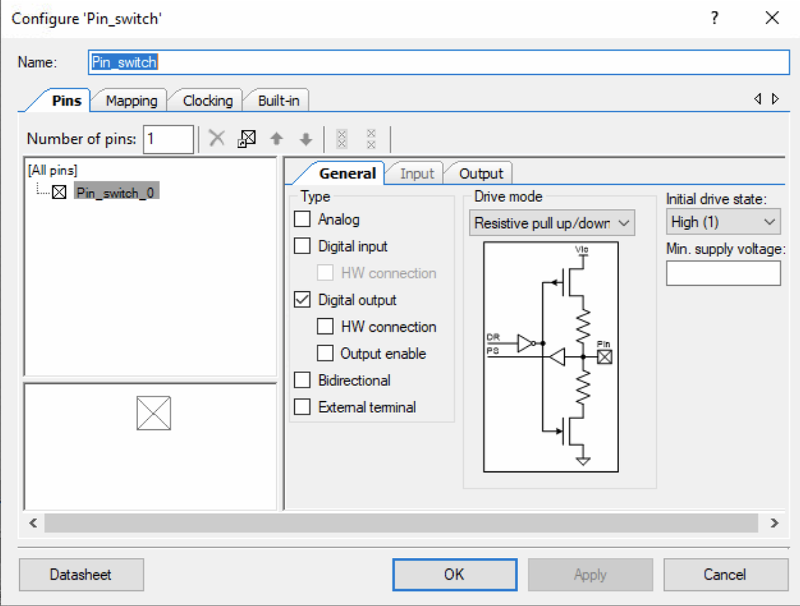

# LED control using switch

Control LED ON time with GPIO press.

The aim of this Lab was to program the LED pin using a switch where the LED should glow for a time instance related to the number of time the switch is pressed in total and for the 6th time, it should be reset to 0 again.

- When the switch is pressed for the **first** time —> Led is ON for **1** second
- When the switch is pressed for the **second** time —> Led is ON for **2** second
- When the switch is pressed for the **third** time —> Led is ON for **3** second
- When the switch is pressed for the **fourth** time —> Led is ON for **4** second
- When the switch is pressed for the **fifth** time —> Led is ON for **5** second
- When the switch is pressed for the **sixth** time —> Led is **OFF** and goes back to **0**
- When the switch is pressed for the **seventh** time —> Led is ON for **1** second and so on…

The Firmware is provided below for guidance along with the **top design**. There is a use of **CyDelay** in firmware to vary the on-time LED according to the switch and also a **Counter** to work as per requirement. **Switch** is mapped to **P3[7]** which is an inbuilt switch in PSoC-4 and **LED** is mapped to **P3[4]** which is an inbuilt LED of PSoC so that it does not require any external hardware.

# Schematic





# PSoC Firmware

```c
/* ========================================
 *
 * Copyright YOUR COMPANY, THE YEAR
 * All Rights Reserved
 * UNPUBLISHED, LICENSED SOFTWARE.
 *
 * CONFIDENTIAL AND PROPRIETARY INFORMATION
 * WHICH IS THE PROPERTY OF your company.
 *
 * ========================================
*/
#include "project.h"
#include<stdio.h>

int main(void)
{
    CyGlobalIntEnable; /* Enable global interrupts. */
    uint8_t counter = 0;
    //char8 str[8];
    /* Place your initialization/startup code here (e.g. MyInst_Start()) */

    for(;;)
    {
        if(Pin_switch_Read() == 0){
            counter += 1;
            if(counter % 6 == 1){
                Pin_led_Write(1);
                CyDelay(1000);
                Pin_led_Write(0);
            }
            if(counter  % 6 == 2){
                Pin_led_Write(1);
                CyDelay(2000);
                Pin_led_Write(0);
            }
             if(counter  % 6 == 3){
                Pin_led_Write(1);
                CyDelay(3000);
                Pin_led_Write(0);
            }
             if(counter  % 6 == 4){
                Pin_led_Write(1);
                CyDelay(4000);
                Pin_led_Write(0);
            }
             if(counter  % 6 == 5){
                Pin_led_Write(1);
                CyDelay(5000);
                Pin_led_Write(0);
            }
            if(counter  % 6 == 0){
                counter = 0;
               // sprintf(str,"counter=%d", counter);
                CyDelay(500);
                //Pin_led_Write(0);
            }
        }
        /* Place your application code here. */
    }
}

/* [] END OF FILE */
```

**— END**